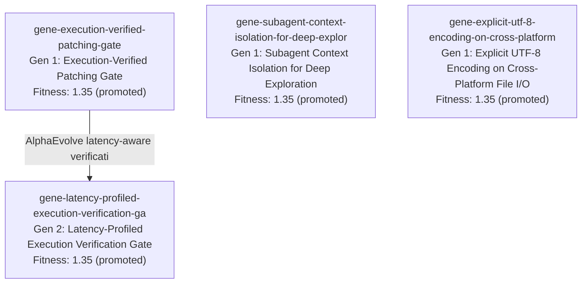

# EVLOP Phylogenetic Lineage Tree (DGM Evolution Archive)

```mermaid
flowchart TD
    gene-latency-profiled-execution-verification-ga["gene-latency-profiled-execution-verification-ga<br/>Gen 2: Latency-Profiled Execution Verification Gate<br/>Fitness: 1.35 (promoted)"]
    gene-execution-verified-patching-gate["gene-execution-verified-patching-gate<br/>Gen 1: Execution-Verified Patching Gate<br/>Fitness: 1.35 (promoted)"]
    gene-subagent-context-isolation-for-deep-explor["gene-subagent-context-isolation-for-deep-explor<br/>Gen 1: Subagent Context Isolation for Deep Exploration<br/>Fitness: 1.35 (promoted)"]
    gene-explicit-utf-8-encoding-on-cross-platform["gene-explicit-utf-8-encoding-on-cross-platform<br/>Gen 1: Explicit UTF-8 Encoding on Cross-Platform File I/O<br/>Fitness: 1.35 (promoted)"]
    gene-execution-verified-patching-gate -->|"AlphaEvolve latency-aware verificati"| gene-latency-profiled-execution-verification-ga
```
